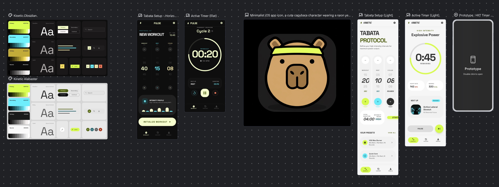

# Tatabara

Tatabara is a SwiftUI iPhone workout timer built for Tabata-style intervals. The current MVP lets you configure work, rest, and cycle counts, launch a session, follow a live timer ring, and hear transition/countdown cues during the workout.

## Highlights

- Configurable interval preset with saved values between launches
- Active workout screen with pause, resume, restart, and stop controls
- Audio cue pipeline for beeps and spoken countdown prompts
- Unit and UI test targets included in the Xcode project

## Tech

- SwiftUI
- Swift 6
- iOS 18 target
- Xcode project: `Tatabara.xcodeproj`

## Run

1. Open `Tatabara.xcodeproj` in Xcode.
2. Select the `Tatabara` scheme.
3. Build and run on an iOS 18 simulator or device.

## Tests

Run the test targets from Xcode, or use the shared `Tatabara` and `TatabaraUnitTests` schemes from the command line.
